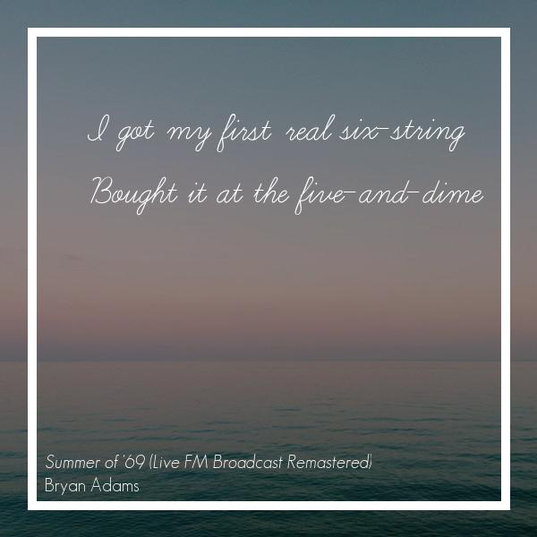

# AlbumArtGenerator
>Create beautiful album art of your favorite tracks!




## Installation & Requirements

Download API.py and Improcess.py along with all the font files. After downloading all the files put them in the same folder and execute the api.py and thats it!

```sh
python api.py
```

Requirements
You need a MusixMatch API Key which can be obtained from signing up on their developer webpage [here](https://developer.musixmatch.com)
You also need some packages which can be installed from pip

```sh
pip install flask
pip install Pillow
pip install requests
pip install json
```

## Usage

After executing the api.py, a localhost address will be displayed on the console. Eg:

```sh
Running on http://127.0.0.1:5000/
```

Visiting the address in the browser will result in an index page

From there you can visit two routes:

```sh
http://127.0.0.1:5000/api/gettrack/
or
http://127.0.0.1:5000/api/getalbumart/
```

This URI takes two parameters, ``artist`` and ``track``
```sh
http://127.0.0.1:5000/api/gettrack/?artist=MrPresident&track=CocoJumbo
```
It returns a json file with possible matches. Every match has an ID associated with it. This ID is needed in the next step.

Using the ID obtained from the previous step, we can now use the second route to generate the album art. Second route uses only one parameter ``id``
```sh
http://127.0.0.1:5000/api/getalbumart/?id=140040286
```

## Release History
* 0.1
  * ADDED: Intial commit!
